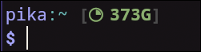

# a pure bash prompt

Pure bash prompt with git integration, docker compose project detection and
diskspace analyzer direcly in pure bash

Inspired by [krashikiworks/pure-prompt-bash](https://github.com/krashikiworks/pure-prompt-bash)

<details>
<summary>Preview</summary>

### **disk-analyzer**:

> Displays the available space in numbers. The icon shows, how much space is
> already taken
>
> Coloring has values for `above 33%`, `above 66%`, `above 87%`, and `less`
>
> `ENABLE_DISKSPACE=true`

> `ENABLE_NERDFONTS=false`


---

> `ENABLE_NERDFONTS=true`



---

### **error-codes**:

> Does only show the error codes on error codes bigger than 0
>
> `ENABLE_ERROR_CODES=true`


---

### **git-status**:

> `ENABLE_GIT=true`


---

### **docker-status**:

> `ENABLE_DOCKER=true`


</details>

## Install

just clone this repository (or just copy pure.bash) anywhere, and add

```bash
source /path/to/pure.bash
```

to your `.bashrc`

## settings

You can set some settings in the prompt file itself:

| key | default_value | properties |
| - | - | - |
| `ENABLE_NERDFONTS` | `true` | Enables or disables [nerdfonts](https://www.nerdfonts.com/font-downloads) in all widgets |
| `ENABLE_DOCKER` | `true` | Enables or disables the docker widget |
| `DOCKER_SANITIZE_NAME` | `false` | Enables or disables the docker project name sanitization |
| `ENABLE_GIT` | `true` | Enables or disables the git widget |
| `ENABLE_DISKSPACE` | `true` | Enables the diskspace widget |
| `ENABLE_SSH`  | `true` | Enables the ssh detection with hostname prefix for ssh sessions |
| `ENABLE_UPTIME` | `false` | Enables the uptime widget |
| `ENABLE_ERROR_CODES` | `true` | Enables the error code display inline |

## Uninstall

just remove what you downloaded, and delete `source` command from your `.bashrc`

## License

MIT License. See [LICENSE](./LICENSE).
