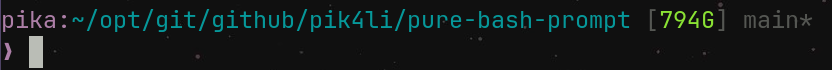
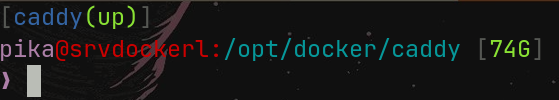
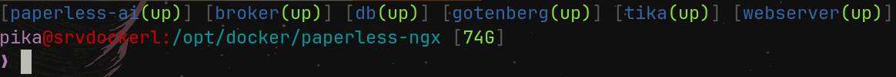

# a pure bash prompt

Pure bash prompt with git integration, docker compose project detection and
diskspace analyzer direcly in pure bash

Inspired by [krashikiworks/pure-prompt-bash](https://github.com/krashikiworks/pure-prompt-bash)

<details>
<summary>Preview</summary>

- **disk-analyzer**:


- **git-status**:



- **docker-status** (ssh):





</details>

## Install

just clone this repository (or just copy pure.bash) anywhere, and add

```bash
source /path/to/pure.bash
```

to your `.bashrc`

## Uninstall

just remove what you downloaded, and delete `source` command from your `.bashrc`

## License

MIT License. See LICENSE.
