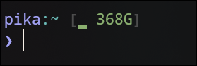

# a pure bash prompt

Pure bash prompt with git integration, docker compose project detection and
diskspace analyzer direcly in pure bash

Inspired by [krashikiworks/pure-prompt-bash](https://github.com/krashikiworks/pure-prompt-bash)

<details>
<summary>Preview</summary>

### **disk-analyzer**:

> has color values for 'above 50%', 'below 50%', and 'below threshhold' <- the
> threshhold is configurable via a VARIABLE
>
> `ENABLE_DISKSPACE=true`



---

### **git-status**:

> `ENABLE_GIT=true`


---

### **docker-status**:

> `ENABLE_DOCKER=true`


</details>

## Install

just clone this repository (or just copy pure.bash) anywhere, and add

```bash
source /path/to/pure.bash
```

to your `.bashrc`

## settings

You can set some settings in the prompt file itself:

| key | default_value | properties |
| - | - | - |
| `ENABLE_DOCKER` | `true` | Enables or disables the docker line |
| `ENABLE_GIT` | `true` | Enables or disables the git widget |
| `ENABLE_SSH`  | `true` | Enables the ssh detection with hostname prefix for ssh sessions |
| `ENABLE_DISKSPACE` | `true` | Enables the diskspace widget |
| `DOCKER_SANITIZE_NAME` | `false` | Enables or disables the docker project name sanitization |

## Uninstall

just remove what you downloaded, and delete `source` command from your `.bashrc`

## License

MIT License. See [LICENSE](./LICENSE).
